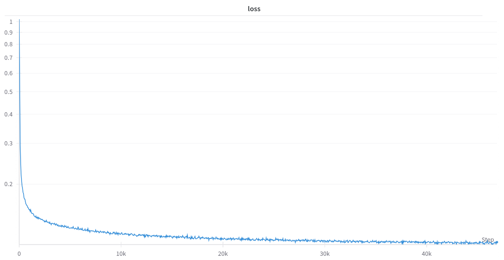

# simple DiT demo

This repo is inspired by: [llama2-accessory](https://github.com/Alpha-VLLM/LLaMA2-Accessory), [minRF](https://github.com/cloneofsimo/minRF), [meta](https://github.com/facebookresearch/DiT).

## Overview

This repo is a simple demonstration of a DiT model. The model is trained on MNIST or CIFAR10. The model is then deployed to github pages with onnx web.

## Training

# [demo here](some link.com)